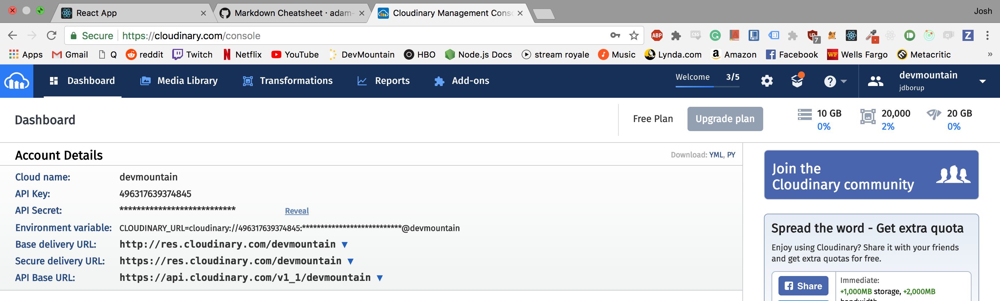
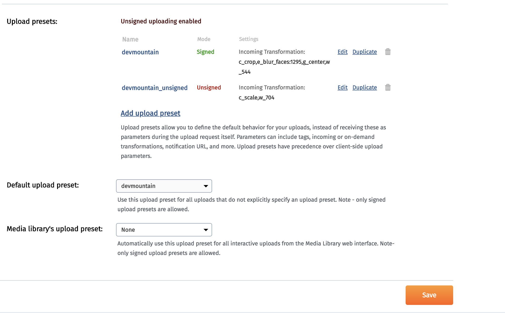

# Signed and unsigned uploads with React and Cloudinary

## Sign up for cloudinary




All of the needed information is in the dashboard, however you can set up custom presets to transform the image on upload by headig to the settings page.



make a preset and head over to your app.

## backend
first set up your server file

```
const app = require('express')()
const cloudinary = require('cloudinary');
const bodyParser = require('body-parser');
require('dotenv').config();

app.use(bodyParser.json())


const port = 4000
app.listen(port, ()=> console.log(`listening on port ${port}`))
```

then make your endpoints so you can pass a signature to your front end that will allow you image to have access to your cloudinary account. you will place this in either your server file or controller based on your file setup

```
app.get('/api/upload', (req, res) => {

```

get a timestamp in seconds which is UNIX format
```
    const timestamp = Math.round((new Date()).getTime() / 1000);
```
cloudinary API secret stored in the .env file
```
    const api_secret  = process.env.CLOUDINARY_SECRET_API;
```
user built in cloudinary api sign request function to  create hashed signature with your api secret and UNIX timestamp
```
    const signature = cloudinary.utils.api_sign_request({ timestamp: timestamp }, api_secret);
```
make a signature object to send to your react app
```
    const payload = {
        signature: signature,
        timestamp: timestamp
    };
        res.json(payload);
})
```


## Frontend

switch over to your react-app and create a function that will initate the signature request from the server when someone has uploaded an image to the client

grab the payload passed from the server with and axios call and insert it along with the file, api key and timestamp into a new form using `new FormData()`

```
handleImageUpload = (file) => {
```
axios call to server to request hashed signature
```
    axios.get('/api/upload').then(response => {
        
 ```       
form data for signed uploads
```
        let formData = new FormData();
        formData.append("signature", response.data.signature)
        formData.append("api_key", "496317639374845");
        formData.append("timestamp", response.data.timestamp)
        formData.append("file", file[0]);
```

this is all then uploaded to cloudinary using the API Base URL


axios call to cloudinary using the URL set at top of page
```
        axios.post(CLOUDINARY_UPLOAD_URL, formData).then(response => {
            console.log(response.data);
```
Set state with the secure_url
```
            this.setState({
                uploadedFileCloudinaryUrl: response.data.secure_url
            })
        }).catch( err => {
            console.log(err);
        })
        
    })
}
```

You can then either save that url in your database or display it directly on the page


